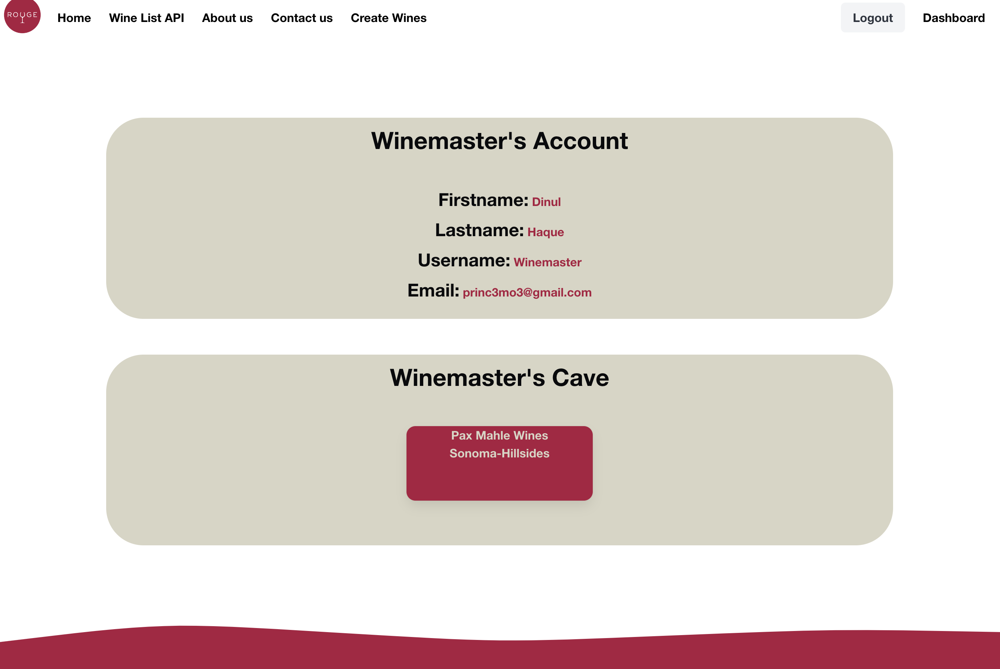
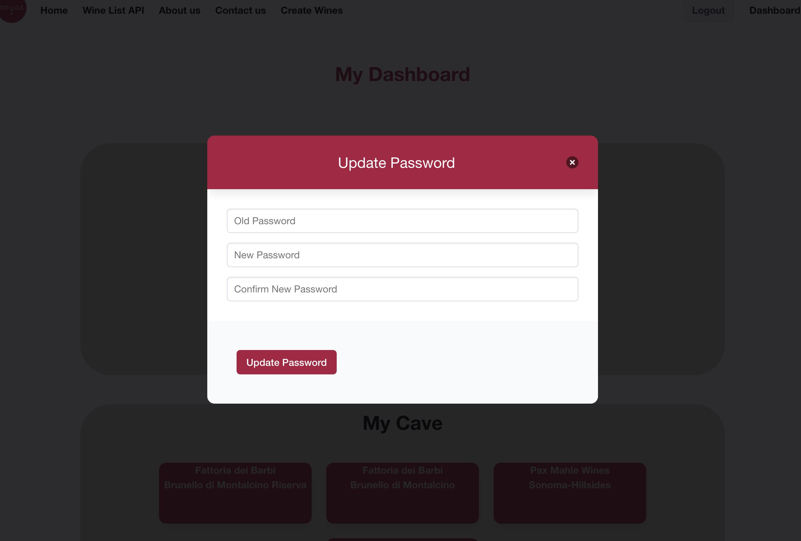

# Project 3 - Rouge wine cave App

## Table of contents

- [Description](#description)
- [Deployement](#deployement)
- [Timeframe & Working Team](#timeframe--working-team)
  - [Home page](#home-page)
  - [Winelist page](#wines-page)
  - [Signup page](#signup-page)
  - [Login page](#login-page)
  - [Wine page](#wine-page)
  - [Dashboard](#dashboard)
  - [Other user's page](#other-users-page)
  - [Change password page](#change-passsword-page)
- [Breif](#breif)
- [Planning](#planning)
- [Build Code Process](#build-code-process)
  - [Change password component code](#change-password-component)
  - [Add-wine-to-the-cave-function code](#add-wine-to-the-cave-function)
- [Wins](#wins)
- [Key Learning/Takeway ](#key-learningtakeaway)
- [Bugs](#bugs)
- [Future Improvements](#future-improvements)

## Description
### Technical requirement

Work in a team, using git to code collaboratively.
Build a full-stack application by making your own backend and your own front-end
Use an Express API with mongoose to serve your data from a Mongo database
Consume your API with a separate front-end built with React
Be a complete product which most likely means multiple relationships and CRUD functionality for at least a couple of models
Implement thoughtful user stories/wireframes that are significant enough to help you know which features are core MVP and which you can cut
Have a visually impressive design to kick your portfolio up a notch and have something to wow future clients & employers. ALLOW time for this.
Be deployed online so it's publicly accessible.


### main app

We decided to work on a wine cave app where users can signup and login. Eache user would be able to:
-Create new wines
-update wine that only the user have created
-delete wines that only the user have created
-Update account details
-Change password
-look for other users
-Se other users profils and caves

## Deployement

We have use Netify to deploy our app

[Link to the APP](https://rouge-wines.netlify.app/)

1. Clone repository
2. Navigate to the project directory
3. Run `npm i`
4. Run `npm run dev` - This should then open a localhost page in your browser

## Timeframe & Working Team

This was a 5 days project to be worked as a team of 2 and |I was paired with Dinul Haque
We worked as partner programing style: 
-The setup part of the project was worked as a driver navigator
- We meet every 4 hours to discussed what would need to be done and split the work load evently 
- We then made sure to be available in case if we needed to reach out to each other 
- For the last day we worked as a driver navigator style for the small details amd deployment 

Technologie used
Frontend app using React.js to use the builder interface using a router on the main app
Hybrid CSS using Bulma as a framework  and some custom CSS
express to build our API

### Home page


### Winelist page


### Signup page


### Login page


### Wine page


### Dashboard


### Other user's page



### Change passsword page



## Breif
The objective of this project was to build a React application using our own API we learned during our classes lessons.

### Front End
This had to included APi fetching, Routing and mapping onl secting whta was needed from the API.
The document structure had to use Different component using router and routes on the main app

### Back end
We had to build the back end using express.js. 
The data structure was done using the VMC (view(router) - Model - Controller)
-View: this is were the router with all the Route are located 
-Model: This is where all our model and schemas are located and were we tell our backend what element are mandatory to create a new entry.
-Controller: This is where we had all our function depending on what we wanted the user to do(Example: create and account or a new wine or just login)

We used Mongoose DB as our database

We also had a seed folder where all our original database was going to be seeded originally 


## Planning
### Front end
```plaintext
|--public
|   |--_redirect
|--src
|   |--assets
|   |    |--images
|   |--components
|   |      |--AboutUs.tsx
|   |      |--ContactUS.tsx
|   |      |--Create.tsx
|   |      |--dashboard.tsx
|   |      |--footer.tsx
|   |      |--Home.tsx
|   |      |--Login.tsx
|   |      |--ProductPage.tsx
|   |      |--ShowUser.tsx
|   |      |--ShowWine.tsx
|   |      |--Signup.tsx
|   |      |--Update.tsx
|   |      |--UpdateAccount.tsx
|   |      |--userList.tsx
|   |      |--WineCard.tsx
|   |      |--WineCardDashboard.tsx
|   |      |--WineList.tsx
|   |--interfaces
|   |      |--user.ts
|   |      |--wine.ts
|   |--styles
|   |    |--main.scss
|   |--App.tsx
|   |--index.d.ts
|   |--main.tsx
|   |--README.MD

```
### Back end
```plaintext
|--config
|   |--environment.ts
|--controllers
|   |--user-controller.ts
|   |--wine controller.ts
|--db
|   |--seed.ts
|--errors
|   |--validation.ts
|--middleware
|   |--secureRoute.ts
|--models
|   |--user.ts
|   |--wine.ts
|--netifly
|   |--functions
|   |      |--api.ts
|--types
|   |--express
|   |      |--index.d.ts
|--views
|   |--.env
|   |--index.d.ts
|   |--README.MD

```

## Build Code Process
Dinul and I initiated the project by seting up the MVC structure and the react framework.
We were particulary proud of the add wine to cave function for both front and back end and the change password functionallity which gave added value to the final product 


### Change password component
#### Front End
```jsx
    async function handleChangePassword() {
        try {
            if (newPassword !== confirmPassword) {
                setErrorMessage('New password and confirmed password do not match');
                return;
            }
            const token = localStorage.getItem('token')
            const resp = await axios.post(`${baseUrl}/rouge/user/verify-password`, { password: oldPassword }, {
                headers: { Authorization: `Bearer ${token}` }
            })
            if (resp.data.isPasswordCorrect) {
                const userId = user ? user._id : null;
                if (userId) {
                    const response = await axios.put(`${baseUrl}/rouge/user/${userId}`, { password: newPassword }, {
                        headers: { Authorization: `Bearer ${token}` }
                    })
                    setLastPasswordChange(new Date(response.data.lastPasswordChange));
                    fetchUser()
                    setErrorMessage('Password has been changed');
                    setIsModalOpen(false);
                    window.location.reload();
                } else {
                    setErrorMessage("User ID is null");
                }
            } else {
                setErrorMessage('Old password is incorrect');
            }
        } catch (error) {
            setErrorMessage("Error updating password: ");
        }
    }
```
#### Back end
```jsx
export async function verifyPassword(req: Request, res: Response) {
    try {
        const { password } = req.body;
        const user = res.locals.currentUser;

        const isValidPw = validatePassword(password, user.password);

        if (isValidPw) {
            res.send({ isPasswordCorrect: true });
        } else {
            res.send({ isPasswordCorrect: false });
        }
    } catch (e) {
        res.status(500).send({ message: "There was an error, please try again later." });
    }
}
```

### Add wine to the cave function
#### Front end
```jsx
    async function addToCave(e: SyntheticEvent) {
        try {
            if (!currentUserCave) {
                setText("User's cave information not available.")
                return;
            }

            const wineAlreadyInCave = currentUserCave.some((wine: any) => wine._id === wineId);
            if (wineAlreadyInCave) {
                setText("This wine is already in your cave.");
                return;
            }

            const token = localStorage.getItem('token');
            if (!token) {
                setText("Token not available.");
                return;
            }

            setText("The wine was added");
            e.preventDefault();


            const resp = await axios.post(`${baseUrl}/rouge/user/cave/${currentUserID}`, wine, {
                headers: {
                    Authorization: `Bearer ${token}`
                }
            });
        } catch (e) {
            setText("Error adding wine to your cave.");
        }
    }
```

#### Back end
```jsx
export async function updateCave(req: Request, res: Response) {
    console.log('HIT UPDATE CAVE ROUTE');

    const userId = req.params.userId;
    try {
        // Find the user with the given userId
        const foundUser = await Users.findById(userId);
        if (!foundUser) {
            return res.status(404).json({ message: 'User not found' });
        }

        // Create a new wine object based on the request body
        const newWine = { ...req.body };

        // Append the new wine object to the myCave array
        foundUser.myCave.push(newWine);

        // Save the updated user
        await foundUser.save();

        // Return the updated cave information
        return res.status(200).json(foundUser.myCave);
    } catch (error) {
        console.error('Error updating cave:', error);
        return res.status(500).json({ message: 'Internal server error' });
    }
}
```

## Wins
After this project I now feel much more comfident developing a fullstack app using react.js and express.js 
I understand how a back end work and how all my end point are talking to each orther
Also working as a pair trained me for the first time to work as a team. doing regular checkup with my teammate made a big difference 

## Key learning/Takeaway
1/ The main issues with then app arisen when we had to create the add wine to cave functionallity. To fix this we spent few hours debuggin first the backend to be able to add wines to the cave on insomnia and then we apllied it to the front end 

2/ The second issue came with the change password functionallity. We needed to find a way to get the password from the datrabase and updated it hashing it again .

## Bugs
When adding a wine the user would have to close the modal to refresh the page. If this isn't done the user could add the wine multiple time which isn't great 

## Future Improvements
-Have the possibility to add an image instead of a link when creating or updating a user or a wine, we wanted to do this with Cloudify but we lacked time and resources.
-Have the functionallity to contact other user
-Have the functionallity to follow other user and be followed by other users
-Comment and rate each wines 