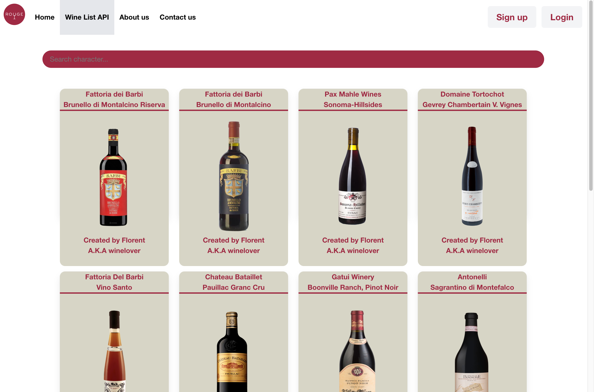
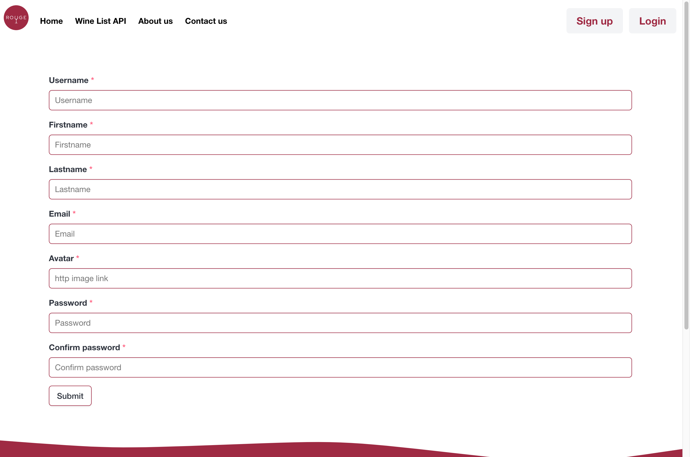
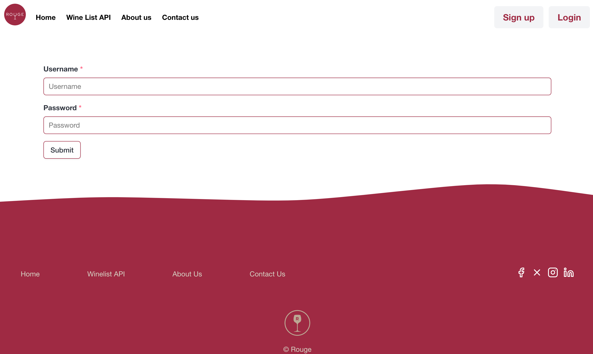
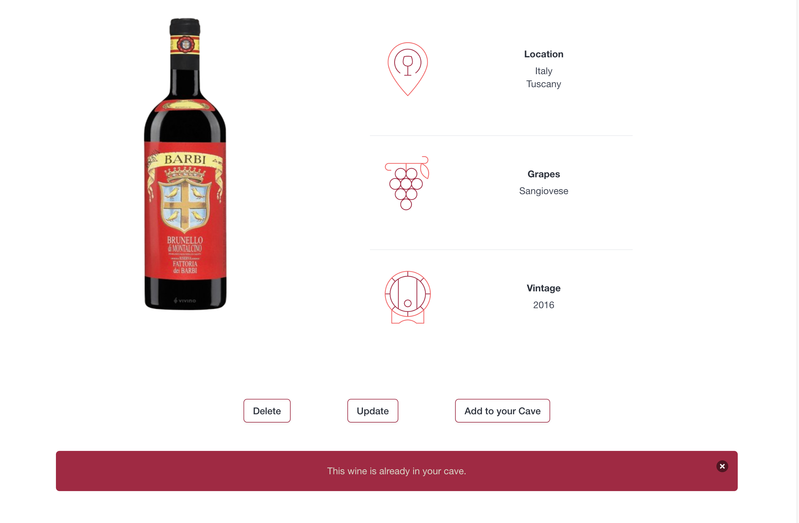
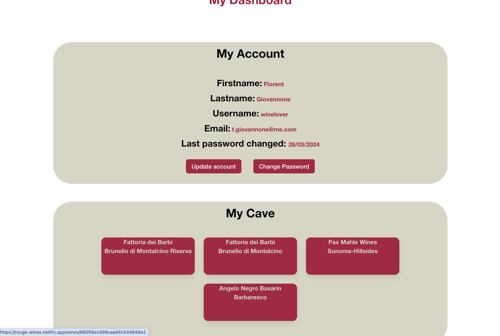

# Project 3 - Rouge wine cave App

## Table of contents

- [Description](#description)
- [Deployement](#deployement)
- [Timeframe & Working Team](#timeframe--working-team)
  - [Home page](#home-page)
  - [Winelist page](#wines-page)
  - [Signup page](#signup-page)
  - [Login page](#login-page)
  - [Wine page](#wine-page)
  - [Dashboard](#dashboard)
  - [Other user's page](#other-users-page)
  - [Change password page](#change-passsword-page)
- [Technologies used](#technologies-used)
- [Breif](#breif)
    - [Frontend](#frontend)
    - [Backend](#backend)
- [Planning](#planning)
- [Build Code Process](#build-code-process)
  - [Change password component code](#change-password-component)
  - [Add-wine-to-the-cave-function code](#add-wine-to-the-cave-function)
- [Wins](#wins)
- [Key Learning/Takeway ](#key-learningtakeaway)
- [Bugs](#bugs)
- [Future Improvements](#future-improvements)

## Description
### Technical requirement

Work in a team, using Git to code collaboratively.
Build a full-stack application by creating your own backend and your own front-end.
Use an Express API with Mongoose to serve your data from a MongoDB database.
Consume your API with a separate front-end built with React.
Create a complete product, which most likely means having multiple relationships and CRUD functionality for at least a couple of models.
Implement thoughtful user stories and wireframes that are significant enough to help you know which features are core MVP and which you can cut.
Design a visually impressive interface to enhance your portfolio and have something to wow future clients and employers. Allow time for this.
Deploy your application online so it is publicly accessible.


### main app

We decided to work on a wine cave app where users can sign up and log in. Each user will be able to:

- Create new wines
- Update wines that only the user has created
- Delete wines that only the user has created
- Update account details
- Change password
- Look for other users
- See other users' profiles and caves

## Deployement

We have use Netify to deploy our app

[Link to the APP](https://rouge-wines.netlify.app/)

1. Clone repository
2. Navigate to the project directory
3. Run `npm i`
4. Run `npm run dev` - This should then open a localhost page in your browser

## Timeframe & Working Team

This was a 5-day project to be worked on as a team of two, and I was paired with Dinul Haque. We worked in a pair programming style:

- The setup part of the project was done in a driver-navigator format.
- We met every 4 hours to discuss what needed to be done and to split the workload evenly.
- We ensured we were available in case we needed to reach out to each other.
- On the last day, we worked in a driver-navigator style to handle the small details and deployment.

### Home page


### Winelist page



### Signup page



### Login page



### Wine page



### Dashboard



### Other user's page


### Change passsword page


## Technologies used

Frontend app using React.js to build the user interface, with routing managed by React Router.
Hybrid CSS using Bulma as a framework and some custom CSS.
Express to build our API.

## Breif
The objective of this project was to build a React application using our own API, which we learned about during our class lessons.

### Frontend
This involved API fetching, routing, and mapping, selectively extracting required data from the API. The document structure comprised different components, managed with routing and routes in the main app.

### Backend
We developed the back end using Express.js. The data structure adhered to the MVC (Model-View-Controller) pattern:
- **View**: This contained the router with all the routes.
- **Model**: Here, we defined models and schemas, specifying mandatory elements for new entries.
- **Controller**: This section housed functions for user actions (e.g., creating an account, adding a new wine, or logging in).

We employed MongoDB with Mongoose as our database. Additionally, we maintained a seed folder for the initial database entries.


## Planning
Before starting, we planned using wireframing.

We also had thorough pseudo-coding prior to dividing tasks.
### Front end
```plaintext
|--public
|   |--_redirect
|--src
|   |--assets
|   |    |--images
|   |--components
|   |      |--AboutUs.tsx
|   |      |--ContactUS.tsx
|   |      |--Create.tsx
|   |      |--dashboard.tsx
|   |      |--footer.tsx
|   |      |--Home.tsx
|   |      |--Login.tsx
|   |      |--ProductPage.tsx
|   |      |--ShowUser.tsx
|   |      |--ShowWine.tsx
|   |      |--Signup.tsx
|   |      |--Update.tsx
|   |      |--UpdateAccount.tsx
|   |      |--userList.tsx
|   |      |--WineCard.tsx
|   |      |--WineCardDashboard.tsx
|   |      |--WineList.tsx
|   |--interfaces
|   |      |--user.ts
|   |      |--wine.ts
|   |--styles
|   |    |--main.scss
|   |--App.tsx
|   |--index.d.ts
|   |--main.tsx
|   |--README.MD

```
### Back end
```plaintext
|--config
|   |--environment.ts
|--controllers
|   |--user-controller.ts
|   |--wine controller.ts
|--db
|   |--seed.ts
|--errors
|   |--validation.ts
|--middleware
|   |--secureRoute.ts
|--models
|   |--user.ts
|   |--wine.ts
|--netifly
|   |--functions
|   |      |--api.ts
|--types
|   |--express
|   |      |--index.d.ts
|--views
|   |--.env
|   |--index.d.ts
|   |--README.MD

```

## Build Code Process
Dinul and I initiated the project by seting up the MVC structure and the react framework.
We were particulary proud of the add wine to cave function for both front and back end and the change password functionallity which gave added value to the final product 
Highlights of our collaboration include:

- **WinesList:** A component for displaying Wines.
- **WinesCard:** A page component for detailed wines information.
- **API Integration:** Utilized `fetch` to retrieve wine data from MongoDB.
- **State Management:** Employed React hooks (`useState`, `useEffect`) for efficient data management and fetching.
- **ChangePassword:** A function to give the user the possibility to change password
- **AddWine:** A function to favourite wines.

On a personal note, my contributions included:
- Handling most of the frontend development tasks, such as mapping the fetched API data.
- Designing the overall look of the app using Bulma.
- Developing the entire logic for both the frontend and backend aspects of the "add to cave" functionality.

### Change password component
For the handle change password, we had both a front-end and a back-end part:

#### Front End
For the front end, we needed to fetch the current user with the userId. Then, we updated the user's information with the provided data. Additionally, we implemented error handling to manage cases where incorrect information was provided.
```jsx
    async function handleChangePassword() {
        try {
            if (newPassword !== confirmPassword) {
                setErrorMessage('New password and confirmed password do not match');
                return;
            }
            const token = localStorage.getItem('token')
            const resp = await axios.post(`${baseUrl}/rouge/user/verify-password`, { password: oldPassword }, {
                headers: { Authorization: `Bearer ${token}` }
            })
            if (resp.data.isPasswordCorrect) {
                const userId = user ? user._id : null;
                if (userId) {
                    const response = await axios.put(`${baseUrl}/rouge/user/${userId}`, { password: newPassword }, {
                        headers: { Authorization: `Bearer ${token}` }
                    })
                    setLastPasswordChange(new Date(response.data.lastPasswordChange));
                    fetchUser()
                    setErrorMessage('Password has been changed');
                    setIsModalOpen(false);
                    window.location.reload();
                } else {
                    setErrorMessage("User ID is null");
                }
            } else {
                setErrorMessage('Old password is incorrect');
            }
        } catch (error) {
            setErrorMessage("Error updating password: ");
        }
    }
```
#### Back end
For the backend we needed to check what the body includes and added a password confirmation to increase security 
```jsx
export async function verifyPassword(req: Request, res: Response) {
    try {
        const { password } = req.body;
        const user = res.locals.currentUser;

        const isValidPw = validatePassword(password, user.password);

        if (isValidPw) {
            res.send({ isPasswordCorrect: true });
        } else {
            res.send({ isPasswordCorrect: false });
        }
    } catch (e) {
        res.status(500).send({ message: "There was an error, please try again later." });
    }
}
```

### Add wine to the cave function
For the Add to cave function, we had both a front-end and a back-end part:

#### Front end
The front end a mostly the error handling a comunication to the user that the the action has been done or not
```jsx
    async function addToCave(e: SyntheticEvent) {
        try {
            if (!currentUserCave) {
                setText("User's cave information not available.")
                return;
            }

            const wineAlreadyInCave = currentUserCave.some((wine: any) => wine._id === wineId);
            if (wineAlreadyInCave) {
                setText("This wine is already in your cave.");
                return;
            }

            const token = localStorage.getItem('token');
            if (!token) {
                setText("Token not available.");
                return;
            }

            setText("The wine was added");
            e.preventDefault();


            const resp = await axios.post(`${baseUrl}/rouge/user/cave/${currentUserID}`, wine, {
                headers: {
                    Authorization: `Bearer ${token}`
                }
            });
        } catch (e) {
            setText("Error adding wine to your cave.");
        }
    }
```

#### Back end
For the backend we get the user id and use it to find the user.
we then push the selected wine into the Mycave Array 
```jsx
export async function updateCave(req: Request, res: Response) {
    console.log('HIT UPDATE CAVE ROUTE');

    const userId = req.params.userId;
    try {
        // Find the user with the given userId
        const foundUser = await Users.findById(userId);
        if (!foundUser) {
            return res.status(404).json({ message: 'User not found' });
        }

        // Create a new wine object based on the request body
        const newWine = { ...req.body };

        // Append the new wine object to the myCave array
        foundUser.myCave.push(newWine);

        // Save the updated user
        await foundUser.save();

        // Return the updated cave information
        return res.status(200).json(foundUser.myCave);
    } catch (error) {
        console.error('Error updating cave:', error);
        return res.status(500).json({ message: 'Internal server error' });
    }
}
```

## Wins
Boosting Confidence in Express and comfirm the React work done before:
- **First touch in backend developement:** I reaaly enjoyed working in express.js and getting the first expeerience with backend developement 
- **Building you own API with noSQL:** I found really fun a intuitive the no SQL form of building an API 

## Chanllenges
The main challenge for this project revolved around implementing the "add to cave" functionality.

The primary issue was ensuring the ability to push wines into a new array inside an array, while correctly targeting the corresponding part of the API for each user.


## Key learning/Takeaway
1. The main issues with the app arose when we had to create the "add wine to cave" functionality. To resolve this, we spent a few hours debugging first the backend to enable adding wines to the cave using Insomnia, and then we applied it to the frontend.

2. The second issue arose with the "change password" functionality. We needed to find a way to retrieve the password from the database and update it by hashing it again.

## Bugs
When adding a wine, the user would have to close the modal to refresh the page. If this isn't done, the user could accidentally add the wine multiple times, which isn't ideal.

## Future Improvements
- Have the possibility to add an image instead of a link when creating or updating a user or a wine. We wanted to implement this using Cloudify, but we lacked time and resources.
- Implement the functionality to contact other users.
- Implement the functionality to follow other users and be followed by other users.
- Allow users to comment on and rate each wine.